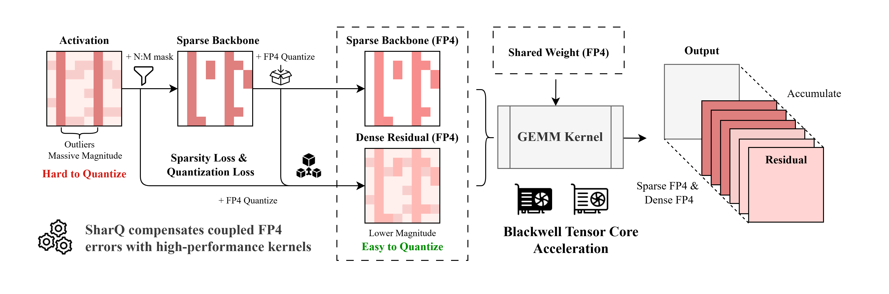

# SharQ🦈: Bridging Activation Sparsity and FP4 Quantization

**Code for the paper "SharQ: Bridging Activation Sparsity and FP4 Quantization for LLM Inference"**

SharQ is a Blackwell-oriented LLM quantization repo built around this idea: use a sparse FP4 main path to capture important activations, then use a dense FP4 residual path to recover the loss from sparsification and quantization.



The repo currently provides four practical modes:

- `NVFP4`: dense FP4 baseline
- `SHARQ`: fused sparse-residual FP4 kernel path
- `SHARQ_TILELANG`: TileLang sparse-residual implementation using real packed FP4 payloads and UE4M3 scale bytes
- `SHARQ_SIM`: pure PyTorch fake-quantized, fake-sparse simulation for accuracy-only reference

## Clone

Clone the repo together with CUTLASS:

```bash
git clone --recurse-submodules https://github.com/actypedef/SharQ.git
cd SharQ
```

If you already cloned the repo without submodules:

```bash
git submodule update --init --recursive
```

## Environment

Create and activate a `conda` environment named `sharq` with Python `3.10`:

```bash
conda create -n sharq python=3.10 -y
conda activate sharq
```

## Repository Layout

```text
model/         model wrappers and evaluation entry point
kernels/       CUDA extension, CUTLASS sparse GEMM integration, low-level benchmarks
benchmarks/    correctness, perf, and ablation scripts
demo/          simple local chat demo
```

For kernel structure, build details, and low-level CUDA benchmarks, see [`kernels/README.md`](kernels/README.md).

## Requirements

- Python `3.10`
- PyTorch with CUDA support
- CUDA `12.8` recommended
- NVIDIA RTX 50 / Blackwell `sm_120a` GPU for the default real `SHARQ` kernel path
- TileLang `0.1.11` for the `SHARQ_TILELANG` path

Install dependencies:

```bash
pip install -r requirements.txt
pip install pybind11
```

## Build

Build the CUDA extension:

```bash
cmake -S kernels -B kernels/build_cmake_sm120a \
  -DCMAKE_BUILD_TYPE=Release \
  -DCMAKE_CUDA_COMPILER=/usr/local/cuda/bin/nvcc \
  -DSHARQ_CUDA_ARCH=sm120a \
  -DPython3_EXECUTABLE=$(which python)

cmake --build kernels/build_cmake_sm120a --target sharq_ops -j
```

If you are targeting B200 instead of RTX 50 series, switch the architecture explicitly:

```bash
cmake -S kernels -B kernels/build_cmake_sm100a -DSHARQ_CUDA_ARCH=sm100a
```

If you only want a numerical reference path, `SHARQ_SIM` does not require the CUDA extension.

`SHARQ_TILELANG` also does not require the CUTLASS CUDA extension. It JIT-compiles TileLang kernels for real shared-NVFP4 weight quantization, sparse/residual activation quantization, and sparse-residual matmul:

```bash
python benchmarks/correctness/example_tilelang_sharq_sanity.py --m 2 --n 64 --k 128
```

## Evaluation

Perplexity:

```bash
python model/main.py /path/to/model \
  --dataset wikitext2 \
  --eval_ppl \
  --quant_type SHARQ

# disable RMSNorm fusion for accuracy ablations
python model/main.py /path/to/model \
  --dataset wikitext2 \
  --eval_ppl \
  --quant_type SHARQ \
  --disable_rmsnorm_fusion
```

Simulation-only reference:

```bash
python model/main.py /path/to/model \
  --dataset wikitext2 \
  --eval_ppl \
  --quant_type SHARQ_SIM
```

TileLang reference:

```bash
python model/main.py /path/to/model \
  --dataset wikitext2 \
  --eval_ppl \
  --quant_type SHARQ_TILELANG
```

Zero-shot lm-eval:

```bash
python model/main.py /path/to/model \
  --tasks piqa,arc_challenge,boolq,hellaswag,winogrande,lambada_openai,arc_easy \
  --lm_eval_num_fewshot 0 \
  --quant_type SHARQ
```

Or use:

```bash
bash evaluate.sh /path/to/model SHARQ
```

## Chat Demo

Single-turn example:

```bash
python demo/chat_qwen.py \
  --model ../Qwen2.5-7B-Instruct \
  --quant-type SHARQ \
  --prompt "Briefly explain SharQ." \
  --max-new-tokens 128
```

Interactive multi-turn example:

```bash
python demo/chat_qwen.py \
  --model ../Qwen2.5-7B-Instruct \
  --quant-type SHARQ
```

## Benchmarks

The benchmark scripts are grouped under:

- [`benchmarks/correctness`](benchmarks/correctness)
- [`benchmarks/perf`](benchmarks/perf)
- [`benchmarks/e2e`](benchmarks/e2e)
- [`benchmarks/ablation`](benchmarks/ablation)

See [`benchmarks/README.md`](benchmarks/README.md) for a short guide.

End-to-end prefill benchmark example:

```bash
python benchmarks/e2e/benchmark_prefill_e2e.py \
  --model /path/to/model \
  --quant-type SHARQ \
  --batch-size 1 \
  --seqlen 2048

# compare against the unfused RMSNorm path
python benchmarks/e2e/benchmark_prefill_e2e.py \
  --model /path/to/model \
  --quant-type SHARQ \
  --batch-size 1 \
  --seqlen 2048 \
  --disable-rmsnorm-fusion
```

The same script also supports `BF16`, `NVFP4`, and `SHARQ_SIM` for side-by-side prefill comparison.

Model evaluation keeps extra fusion disabled for accuracy measurements, while the benchmark and demo paths enable both RMSNorm fusion and epilogue fusion automatically.

## Supported Models

- Llama
- Qwen2
- Mixtral

## Dependencies

- [CUTLASS](https://github.com/NVIDIA/cutlass)
- [transformers](https://github.com/huggingface/transformers)
- [lm-evaluation-harness](https://github.com/EleutherAI/lm-evaluation-harness)
