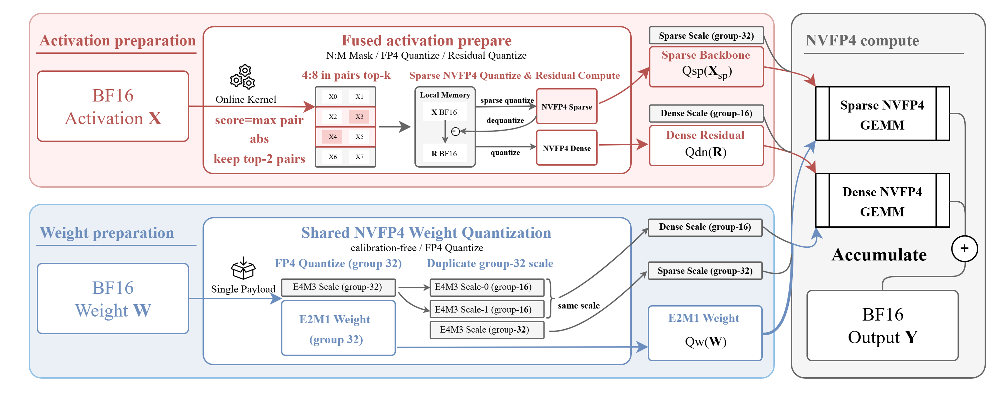

# SharQ Kernels

This directory contains the CUDA extension and low-level kernel code used by SharQ.



## Main Components

- [`src/nvfp4.cu`](src/nvfp4.cu): dense NVFP4 GEMM path
- [`src/reorder.cu`](src/reorder.cu): dense activation/weight quantization kernels used by the dense baseline
- [`src/fused_sparse_prepare.cu`](src/fused_sparse_prepare.cu): fused SharQ activation kernel
- [`src/sparse_nvfp4.cu`](src/sparse_nvfp4.cu): CUTLASS-based sparse NVFP4 GEMM wrapper
- [`src/shared_weight_nvfp4.cu`](src/shared_weight_nvfp4.cu): shared-payload `W32` weight preparation
- [`src/bindings.cpp`](src/bindings.cpp): Python bindings exposed through `sharq_ops`

Headers live in [`include/`](include), and standalone CUDA benchmarks live in [`benchmark/`](benchmark).

## Build

```bash
cmake -S kernels -B kernels/build_cmake_sm120a \
  -DCMAKE_BUILD_TYPE=Release \
  -DCMAKE_CUDA_COMPILER=/usr/local/cuda/bin/nvcc \
  -DSHARQ_CUDA_ARCH=sm120a \
  -DPython3_EXECUTABLE=$(which python)

cmake --build kernels/build_cmake_sm120a --target sharq_ops -j
```

The built extension is:

```text
kernels/build_cmake_sm120a/sharq_ops.so
```

## Notes

- The default real SharQ kernel path targets NVIDIA RTX 50 / Blackwell `sm_120a`.
- Pass `-DSHARQ_CUDA_ARCH=sm100a` if you need the B200 (`sm_100a`) path instead.
- Python-side loaders search the native build first, with `kernels/build_cmake_sm120a/`, `kernels/build_cmake_sm100a/`, and `kernels/build/` as the fallback order when no CUDA device is visible.
- `SHARQ_SIM` does not use this extension; it is a pure PyTorch reference mode.

## Low-Level Benchmarks

Build the standalone CUDA benchmarks if needed:

```bash
cmake --build kernels/build_cmake_sm120a --target bench_nvfp4 -j
cmake --build kernels/build_cmake_sm120a --target bench_sparse_nvfp4 -j
cmake --build kernels/build_cmake_sm120a --target bench_sharq_linear -j
```

`bench_sharq_linear` is the main CUDA-side performance harness for comparing NVFP4 and SHARQ at three levels:

- quantize only
- GEMM only
- whole linear

It runs entirely on the CUDA/CUTLASS side with preallocated buffers, and treats weight quantization as an offline cost.

Higher-level Python benchmark scripts live in:

- [`../benchmarks/correctness`](../benchmarks/correctness)
- [`../benchmarks/perf`](../benchmarks/perf)
- [`../benchmarks/ablation`](../benchmarks/ablation)
